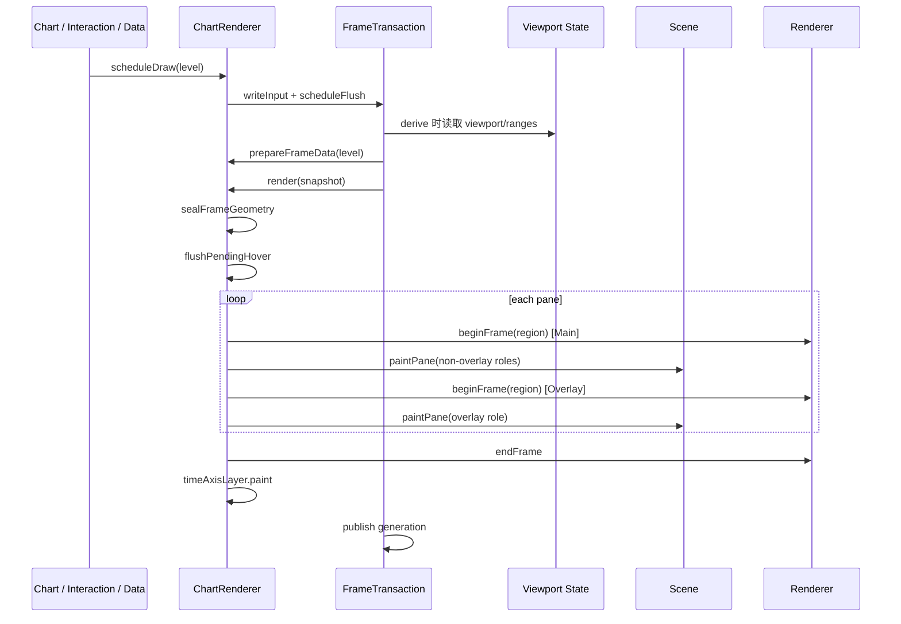

# Core 渲染架构

> 更新日期：2026-08-19 | 适用范围：`packages/core` 当前运行时绘制实现

本文是 Core 渲染架构的事实来源。内容直接对应当前代码，描述状态如何进入一帧、几何如何封存、
Layer 如何调度，以及 WebGPU、WebGL2 和 Canvas2D 如何输出结果。

## 1. 设计目标

渲染系统必须同时满足以下约束：

- 绘制、交互和指标读取同一代 viewport 与 K 线几何。
- 高频输入在一帧内合并，不允许重入绘制污染当前帧。
- 业务 Layer 不依赖具体 GPU API，只依赖统一 `Renderer`。
- GPU 批次不能完成时必须明确返回失败，由业务代码完整回退到 Canvas2D。
- Canvas drawing buffer、CSS 尺寸和 GPU viewport 必须使用同一个有效 DPR。
- Main 与 Overlay 分开更新，十字线移动不能重画静态主层。
- 后端切换、WebGPU device lost 和资源销毁由单一生命周期所有者管理。

## 2. 分层

```text
Framework adapter
  挂载 ChartDom、转发输入事件、订阅 readonly signals
        |
        v
Chart
  组合 StateKernel、ViewportManager、PaneLayout、ChartRenderer、RendererHost
        |
        +------------------------------+
        |                              |
        v                              v
StateKernel                        RendererHost
  viewport / zoom / data / pane      backend 创建、切换、降级、resize、dispose
        |                              |
        +---------------+--------------+
                        v
                  ChartRenderer
          FrameTransaction + 几何准备 + pane 绘制
                        |
                        v
                  Scene / Layer
          pane/role/visible 过滤 + z 顺序 paint
                        |
                        v
                    Renderer
          drawInstances / drawLines / SurfaceBackend
                 /          |          \
             WebGPU       WebGL2     Canvas2D fallback
```

各层只承担一种所有权：

| 层                                 | 负责                                         | 不负责                  |
| ---------------------------------- | -------------------------------------------- | ----------------------- |
| `Chart`                            | 依赖组装、公共 API、后端设置同步             | 单帧绘制细节            |
| `StateKernel`                      | viewport、zoom、data、pane、theme 等业务状态 | DOM 监听和绘制副作用    |
| `ChartViewportManager`             | ResizeObserver、scroll DOM 事件              | 派生 viewport           |
| `ChartPaneLayout` / `PaneRenderer` | pane 布局和 Canvas DOM 生命周期              | Scene 调度              |
| `ChartRenderer`                    | 帧事务、几何快照、canvas 清理、逐 pane paint | RendererPlugin 注册     |
| `Scene`                            | Layer 集合、过滤、排序和 paint 分发          | 帧边界与后端选择        |
| `RendererHost`                     | Renderer 生命周期和后端降级                  | 业务图元                |
| `Renderer`                         | 后端无关绘制原语                             | K 线、指标等业务语义    |
| `SurfaceBackend`                   | drawing surface、region、clear、composite    | buffer 和 pipeline 语义 |

## 3. 初始化与所有权

`Chart` 构造时完成渲染依赖组装：

1. 使用注入的 `RendererHost`，否则调用 `createDefaultRendererHostSync()`。
2. 用 Host 当前 runtime 初始化 `kernel.renderer`。
3. 注册 Host listener：runtime 变化写回 kernel，并同步 WebGPU DOM canvas。
4. 把 `rendererHost.resize()` 注入 viewport state 的 DOM effect。
5. 创建 `ChartPaneLayout` 和 `ChartRenderer`。
6. 注册 drawing Layer 和内置 Layer。
7. 初始化 viewport DOM 监听。
8. 安装 active renderer projection，按 kernel 描述符控制受管 Layer 可见性。

`ChartRenderer` 不缓存 Renderer 实例。每次绘制通过 `getSceneRenderer()` 读取
`rendererHost.renderer`，因此热切换后下一帧直接使用新后端。

销毁顺序保证业务资源先于底层设备释放：

```text
indicator manager
  -> RendererPluginManager.clear
  -> ChartRenderer.destroy / Scene.dispose
  -> data / viewport / pane managers
  -> 移除 WebGPU DOM canvas
  -> RendererHost.dispose
  -> StateKernel / PluginHost
```

## 4. Viewport 是几何入口

### 4.1 状态来源

`engine/state/viewportState.ts` 是 viewport 派生状态的唯一来源。它维护或派生：

- `viewWidth`、`viewHeight`：容器 CSS 尺寸。
- `preciseDpr`：ResizeObserver 提供的精确 DPR，`0` 表示使用运行时回退。
- `dpr`：经过环境规则和画布像素上限钳制后的有效 DPR。
- `plotWidth`、`plotHeight`：绘图区逻辑尺寸。
- `contentWidth`、`maxScrollLeft`、`scrollLeft`、`scrollLeftLogical`。
- `kGap`：由 `kWidth + dpr + period` 自动派生。
- `rawVisibleRange`：允许扩窗，左缘 `start` 可以为 `-1`。
- `visibleRange`：已经 clamp，供绘制、hit-test 和指标使用。
- `viewport` 与对外 `viewportState` 快照。

对象型 computed 带引用缓存。字段未变化时返回同一对象，避免下游因新对象 identity 产生虚假通知。

### 4.2 Resize 与 DPR

`ChartViewportManager` 只负责 DOM 适配：

1. `initViewport()` 立即读取首帧容器尺寸，不依赖 ResizeObserver 首次回调。
2. container scroll 事件调用 `viewport.actions.syncFromDomScroll()`。
3. ResizeObserver 优先观察 `device-pixel-content-box`。
4. `devicePixelContentBoxSize / contentBoxSize` 得到的 DPR 按 `1/64` 吸附。
5. 尺寸或 precise DPR 变化后调用 `Chart.resize()`，重新布局 pane 并申请全量绘制。

有效 DPR 规则：

- Electron 直接使用 `window.devicePixelRatio`。
- 有效 `preciseDpr > 0` 时优先使用 precise DPR。
- 其他环境读取 `window.devicePixelRatio`，按 `1/64` 吸附，最低为 `1`。
- `viewWidth * dpr * viewHeight * dpr` 超过 16M 像素时，`clampDpr()` 主动降低 DPR。

绘制代码不能自行读取 `window.devicePixelRatio`。

### 4.3 DOM 同步

viewport state 的 effect 承担所有尺寸副作用：

- 同步 `canvasLayer` CSS 尺寸。
- 同步 xAxis canvas 的物理尺寸和 CSS 尺寸。
- 同步 scroll content 宽度和 container scrollLeft。
- 调用 `RendererHost.resize(plotWidth, plotHeight, dpr)`。

`ChartPaneLayout.layoutPanes()` 根据 pane ratio、最小高度和 pane gap 计算每个 pane 的 `top` 与
`height`，再调用 `PaneRenderer.resize(plotWidth, paneHeight, dpr)`。

## 5. 可见范围与帧几何

### 5.1 可见范围

可见范围在 viewport computed 中产生，不在 paint 前手动同步：

- 普通 K 线调用 `getVisibleRange(scrollLeft, plotWidth, kWidth, kGap, dataLength, dpr)`。
- 分时图调用 `computeTimeShareVisibleRange()`，与分时 session slot 网格使用同一模型。
- `rawVisibleRange` 用于左缘扩窗和增量加载判断。
- `visibleRange` 是 `clampVisibleRange(rawVisibleRange)`，可直接索引数据。

指标调度器订阅同一个 `visibleRange` signal，交互也读取 viewport state，因此不存在独立的手工
可见区缓存同步路径。

### 5.2 `prepareFrameData`

`ChartRenderer.prepareFrameData(level)` 生成当前代 `FrameContext`：

1. Overlay 且已有 `cachedDrawFrame` 时复用 viewport、range 和 K 线几何。
2. 读取 viewport；首帧尺寸未建立时返回 `null`。
3. 读取当前 render data；无数据时返回 `null`。
4. 从 viewport state 读取 clamped range 和 raw range。
5. range 变化时安排可见区缺口检查。
6. 非缓存帧计算 `kLineCenters`，再派生 `kLinePositions` 和 `kBarRects`。
7. 保存几何缓存，供后续 Overlay 帧复用。
8. 把 data、zoom level 等本帧输入一起放入 `FrameContext`。

### 5.3 K 线物理像素几何

普通 K 线使用 `getPhysicalKLineConfig(kWidth, kGap, dpr)` 建立物理像素网格。当前几何以
`kLineCenters` 为起点：

```text
center logical
  -> round(center * dpr)
  -> 按奇数 kWidthPx 计算实体左边界
  -> 按奇数 barWidthPx 计算柱体左边界和宽度
  -> 除以 dpr 回写逻辑坐标
```

奇数物理宽度保证中心线落在确定的设备像素上。`kLinePositions` 是兼容仍需要左边界的绘制接口，
交互和新几何优先使用 `kLineCenters`。

分时图使用 `computeTimeShareXLayout()`：

- 横向位置由 market session slots 决定，而不是按已到达数据数量铺满宽度。
- 已到达数据落在对应时段槽位。
- 未到达时段保留右侧空白。
- `barVisible` 可以让某些 slot 的柱体宽度为 `0`。

### 5.4 几何封存

FrameTransaction 进入 render 阶段后，`sealFrameGeometry()` 在任何 paint 之前执行：

```text
interaction.setKLinePositions(
  frame.kLinePositions,
  frame.range,
  frame.kWidthPx,
  frame.kLineCenters,
)
```

随后 `flushPendingHover()` 使用本帧几何完成最近 K 线吸附和十字线更新。交互命中与屏幕上的图形
因此属于同一代。

## 6. 帧事务

`foundation/reactivity/frameTransaction.ts` 把高频绘制请求合并成不可重入的帧事务。

### 6.1 调度入口

| API                                 | 行为                                                      |
| ----------------------------------- | --------------------------------------------------------- |
| `Chart.scheduleDraw(level)`         | runtime projection 期间合并请求，否则代理到 ChartRenderer |
| `ChartRenderer.scheduleDraw(level)` | 合并 UpdateLevel，同一 pending 帧只注册一次 rAF           |
| `Chart.draw(level)`                 | 请求同步 flush；事务非 idle 时退化为下一帧调度            |

`Main + Overlay` 合并为 `All`。事务运行期间产生的新输入只能进入下一代。

### 6.2 阶段

一次成功 flush 固定经过：

1. `capturing`：封存当前 input。
2. `deriving`：调用 `prepareFrameData()` 生成快照。
3. `sealing`：冻结快照根对象，大数组继续结构共享。
4. `rendering`：封存交互几何并执行 `drawWithFrame()`。
5. `publishing`：推进 generation，发布只读快照。

阶段结束后回到 `idle`。render/publish 中的 `writeInput()` 进入 `nextPending`，当前事务结束后自动
合并并调度。非 idle 时调用 `flush()` 不会嵌套绘制。

derive 或 render 抛错时不推进 generation，封存输入保留为 dirty 并安排重试。

### 6.3 当前时序



Main 或 Overlay 分支是否执行由 `UpdateLevel` 和十字线状态决定，不是每帧固定执行两次。

## 7. Canvas 与 DOM 分层

### 7.1 每个 pane

`PaneRenderer` 持有以下 Canvas2D context：

| Canvas                   | 内容                                               | 更新时机      |
| ------------------------ | -------------------------------------------------- | ------------- |
| `mainCanvas`             | background、primary、indicator、component、drawing | Main / All    |
| `overlayCanvas`          | crosshair、hover 等 overlay                        | Overlay / All |
| `yAxisCanvas`            | 右轴静态刻度和标签                                 | Main / All    |
| `yAxisOverlayCanvas`     | 右轴动态价签                                       | Overlay / All |
| `leftYAxisCanvas`        | 左轴静态内容                                       | Main / All    |
| `leftYAxisOverlayCanvas` | 左轴动态价签                                       | Overlay / All |

左右轴 Canvas 都由 `ChartPaneLayout` 创建；左轴 DOM layer 是否存在由宿主布局决定。

plot 区层级：

```text
z-index 0  pane mainCanvas
z-index 1  chart 级 gpu-scene-canvas（仅 WebGPU）
z-index 2  pane overlayCanvas
```

全图另有一张 `xAxisCanvas`。时间轴是独立 Layer，不注册进主 Scene。

### 7.2 Canvas 尺寸

`PaneRenderer.resize()` 以逻辑尺寸和有效 DPR 计算 drawing buffer：

```text
physical width  = round(logical width * dpr)
physical height = round(logical height * dpr)
CSS width       = physical width / dpr
CSS height      = physical height / dpr
```

这样 CSS 显示尺寸由实际 drawing buffer 反算，避免浏览器再次缩放。paint 前 context 重置 transform，
再执行 `scale(dpr, dpr)`，所以业务 2D 绘制继续使用逻辑坐标。

### 7.3 UpdateLevel

| Level     | 几何     | main / 静态轴 | overlay / 动态轴                 | Scene 调度               |
| --------- | -------- | ------------- | -------------------------------- | ------------------------ |
| `Main`    | 重算     | 清理并绘制    | 不更新                           | 非 overlay roles         |
| `Overlay` | 复用缓存 | 不更新        | 有当前或上一帧十字线时清理并绘制 | `overlay`                |
| `All`     | 重算     | 清理并绘制    | 清理并绘制                       | 先非 overlay，再 overlay |

Overlay 只有在 `cachedDrawFrame` 已存在时才复用几何；首个请求就是 Overlay 时仍会执行正常推导。
`overlayHadCrosshair` 保证十字线从有到无时仍执行最后一次 Overlay 清理。

## 8. Pane 绘制

`renderPanes()` 对每个可见 pane 执行：

1. 非缓存帧更新 pane Y 轴范围；比较视图使用可见折线范围。
2. 根据 UpdateLevel 清理目标 Canvas2D context。
3. 构建业务 `RenderContext`，包含 data、range、scroll、K 线几何、轴 context、theme 和共享 labels。
4. 计算当前 pane 的 Y 轴 ticks。
5. 把 context 写入 `paneCtxMap`，供 Layer bridge 获取。
6. 构建 `{ x: 0, y: pane.top, width: plotWidth, height: pane.height, dpr }` region。
7. Main 分支调用 `Renderer.beginFrame(region)`，再 paint 非 overlay roles。
8. Overlay 分支再次调用 `Renderer.beginFrame(region)`，再 paint `overlay` role。

所有 pane 完成后只调用一次 `Renderer.endFrame()`。之后 `renderXAxis()` 构造时间轴 context，并直接
调用 `timeAxisLayer.paint()`。

空数据时不会进入 pane paint。ChartRenderer 清理所有 2D canvas；若当前为 WebGPU，还会显式向
可见 GPU canvas 提交一次透明 clear，避免残留上一帧纹理。

## 9. Scene 与 Layer

### 9.1 Scene 规则

`createScene()` 持有注册顺序数组和只读 `layers` signal。`paintPane(ctx, roles?)`：

1. 选择 `layer.paneRole === ctx.paneRole` 或 `global` 的 Layer。
2. 跳过不可见 Layer。
3. 有 roles 参数时进一步过滤。
4. 按 `z` 升序稳定排序；相同 z 保持注册顺序。
5. 依次调用 `layer.paint(ctx)`。

重复 Layer id 采用 first-wins。增删 Layer 时 signal 发布新数组。修改 `visible` 不更换数组 identity，
避免批量显隐造成框架订阅风暴。

Scene 自身不吞掉 `paint()` 异常。旧 RendererPlugin 经 `createLayerFromPlugin()` 桥接时，桥接层会
隔离单个 plugin draw 异常，并把 `PaintContext.renderer` 注入业务 `RenderContext.sceneRenderer`。

### 9.2 Layer role

```text
background  网格、静态轴背景类内容
primary     K 线、分时主序列、成交量柱
indicator   MA、BOLL、MACD 等指标
component   Volume Profile、Heatmap、Footprint 等组件
drawing     用户绘图
overlay     十字线、hover、动态标签
```

role 用于分组更新，`z` 才是最终叠放顺序。

### 9.3 当前内置 Layer

ChartRenderer 初始化时安装：

- grid lines
- candle
- time-share primary renderer
- last-price label
- comparison line
- last-price line
- custom markers
- extrema markers
- main-indicator legend
- crosshair
- right Y-axis static / overlay
- left Y-axis static / overlay
- drawing / drawing-label overlay

time axis 单独持有。动态指标通过 `Chart.installRenderer` 注册到 RendererPluginManager，再桥接为
Scene Layer。Manager 负责注册、配置、启停和卸载元数据，主 paint 不调用 Manager.render。

`kernel.activeRenderers$` 输出 Layer 描述符。Chart 订阅该投影，只修改受管 Layer 的可见性；
computed 不调用 renderer factory，也不直接产生 Scene 副作用。

## 10. Renderer 契约

`rendering/render/Renderer.ts` 定义所有后端的共同接口。

### 10.1 能力与资源

`RendererCapabilities` 暴露：

- `compute`
- `storageBuffer`
- `maxInstances`
- backend `name`

资源使用不透明 handle：

- `createBuffer / writeBuffer / destroyBuffer`
- `createPipeline / destroyPipeline`
- `createComputePipeline / destroyComputePipeline`

当前 WebGPU MVP、WebGL2 和 Canvas2D 的 `compute` 都是 `false`。虽然接口预留 compute，现阶段没有
可执行 compute 的默认后端；调用方必须检查 caps，不能按 backend 名称推断。

### 10.2 帧与绘制原语

- `beginFrame(region)` 设置当前 pane region。
- `drawInstances()` 绘制矩形类 instance batch。
- `drawLines()` 绘制单条、多条 strip 或填充带。
- `endFrame()` 收口当前 chart frame。

`drawInstances()` 和 `drawLines()` 返回 boolean：

```text
true   该批已经由 Renderer 接受并负责输出
false  未输出；调用方必须完整执行 Canvas2D fallback
```

返回 `false` 的原因可以是 surface 不可用、pipeline 类型不匹配、buffer 缺失、参数非法或后端不支持。
禁止 GPU 路径失败后只补画部分 2D 内容，也禁止 GPU 成功后再次画同一批 2D。

### 10.3 SurfaceBackend

SurfaceBackend 负责：

- 检查 surface 是否可用。
- 按逻辑尺寸和 DPR 调整 drawing buffer。
- 绑定逻辑像素 `SurfaceRegion`。
- 清理 region。
- 在需要时把 GPU 内容合成到 2D context。
- 幂等销毁。

`SurfaceRegion` 始终使用逻辑像素。后端负责转换成物理 viewport/scissor。

## 11. 后端实现

### 11.1 Canvas2D

Canvas2D Renderer 是 GPU 原语的空后端：

- `surface.isAvailable()` 返回 `false`。
- `drawInstances()` 和 `drawLines()` 返回 `false`。
- compute API 抛错。

这不是另一套自动绘制器。它通过统一 Renderer 契约明确要求业务 Layer 使用已有 2D context 完成
fallback。

### 11.2 WebGL2

WebGL Renderer 包装 chart 级 `SharedWebGLSurface`，并使用 candle 和 line surface 执行实际绘制。

- `beginFrame(region)` 绑定共享 surface region，并设置各图元 surface 的 region。
- instance、line 和 fill 调用立即执行 WebGL draw。
- WebGL surface 输出需要在业务 helper 成功后立即 `compositeTo(mainCtx, region)`。
- line helper 必须一次提交多条 strips，不能逐条 draw 导致 MSAA clear 覆盖前一条。
- `endFrame()` 当前没有延迟提交工作。

WebGL composite 发生在 Layer paint 内。WebGPU 不走此路径。

### 11.3 WebGPU

WebGPU 使用一张 chart 级可见 canvas：

- Chart 把 `gpu-scene-canvas` 挂在 main canvas 和 overlay canvas 之间。
- 多 pane 共用该 canvas，通过 region 的物理 viewport/scissor 隔离。
- `SurfaceBackend.compositeTo()` 是 no-op，禁止 GPU -> Canvas2D `drawImage`。
- 半透明填充必须把 alpha 烘焙进颜色，而不是依赖 2D composite alpha。

一帧内：

1. `beginFrame(region)` 更新当前 region。
2. `drawInstances/drawLines` 只把 draw 记录追加到 `pendingDraws`。
3. `endFrame()` 按 region 分组 pending draws。
4. 所有 region 在一个 RenderPass 中依次设置 viewport/scissor。
5. 结束 pass 后执行一次 `device.queue.submit()`。

当前实现使用 4x MSAA，单 pass clear 和 resolve。不得在 pane 或 Layer 中途 submit，否则会破坏
每 chart frame 单次提交的不变量。

WebGPU 资源策略：

- pipeline 按图元类型缓存。
- uniform buffer 使用跨帧 pool，帧开始重置游标。
- line strip 使用 `WebGPUResourceTable`，按 key、revision 和 capacity 复用 buffer。
- 未在本帧 touch 的 strip key 在帧结束时清理。
- 显式销毁的普通 buffer 等待已提交 GPU 工作完成后再 destroy。

`clearRegion()` 是空数据或全量清屏的例外路径，会单独提交透明 clear。

## 12. RendererHost

RendererHost 是具体 Renderer 的唯一生命周期所有者。

### 12.1 创建和降级

| preference | 创建顺序                  |
| ---------- | ------------------------- |
| `webgpu`   | WebGPU -> WebGL -> Canvas |
| `webgl`    | WebGL -> Canvas           |
| `canvas`   | Canvas                    |

`runtime` 包含：

- `effective`：实际后端。
- `status`：`initializing | ready | switching | degraded | failed`。
- `error`：第一次创建失败或 runtime 故障信息。

实际后端低于 preference 时状态为 `degraded`。

默认 Chart 构造走同步 Host：尝试 WebGL，失败使用 Canvas。用户修改 `settings.rendererBackend` 时，
Chart 调用异步 `switchTo()`，切换成功后同步 WebGPU canvas 并申请 All 重绘。

### 12.2 热切换

`switchTo()` 使用 generation 丢弃过时的并发创建结果。新 Renderer 创建完成后：

1. 应用 Host 记住的 surface 尺寸。
2. 原子替换 active Renderer。
3. 发布 runtime。
4. 请求重绘。
5. 销毁旧 Renderer。

ChartRenderer 每次从 Host 取 active Renderer，因此不需要重建 Scene 或 Layer。

### 12.3 Device lost

WebGPU `device.lost` 回调进入 `RendererHost.handleDeviceLost()`：

1. runtime 立即标记为 `degraded` 并记录原始错误。
2. 尝试 `WebGL -> Canvas`。
3. 成功后恢复 surface 尺寸、替换 Renderer、请求重绘并销毁旧设备。
4. 整条降级链失败时状态变为 `failed`。

## 13. 物理像素规则

以下规则是渲染正确性的硬约束：

1. StateKernel 的 viewport DPR 是唯一 DPR。
2. 对外 region 和业务几何使用逻辑像素。
3. Canvas drawing buffer 和 GPU viewport/scissor 使用物理像素。
4. 线条、矩形边界和宽度在物理像素空间取整，再转换回逻辑坐标。
5. GPU shader 或预处理 helper 必须显式处理 DPR，不能把逻辑坐标直接当设备坐标。
6. WebGPU/WebGL 坐标转换使用 `physicalRegion.ts`、`physicalLine.ts` 等共享规则。
7. GPU composite 禁止 image smoothing，避免纹理二次采样变糊。

不要在 Layer 内建立第二套 resize、DPR 或 scroll 缓存。

## 14. 尚未接入主链路的能力

以下代码存在并有独立测试，但不是 ChartRenderer 当前运行时的一部分。

### 14.1 `renderer-tier`

`rendering/renderer-tier` 同步探测：

```text
webgpu > webgl2 > canvas2d > none
```

并能从调用方 registry 中选择 factory。RendererHost 当前有自己的实际创建与降级链，且 backend
命名为 `webgpu | webgl | canvas`。在统一命名、runtime 和失败语义前，不能把两套选择结果同时
作为状态来源。

### 14.2 `scheduler`

`rendering/scheduler/createFrameBudget.ts` 提供优先级队列、同 id 合并、deadline、队列上限和帧耗时
统计。它适合可分片工作，但没有接入 FrameTransaction 或 ChartRenderer。

FrameTransaction 负责原子帧快照，FrameBudget 负责可延期任务，两者语义不同。

### 14.3 `retainedScene`

`rendering/scene/retainedScene.ts` 已实现按 key/revision 保存 rects、lines 和 band 节点，并支持按 pane
收集、z 排序和过期清理。主 Scene 当前仍逐帧调用 Layer.paint，尚未消费 RetainedScene 节点。

WebGPUResourceTable 的局部 buffer 复用不等于 RetainedScene 已接入。

## 15. 扩展规则

### 15.1 新增业务图形

1. 在 `engine/render/layers` 或 `engine/renderers` 实现 Layer/RendererPlugin。
2. 从 `RenderContext` 读取本帧数据和几何，不读取 DOM。
3. 优先使用已有 `drawInstances/drawLines` helper。
4. GPU 返回 false 时完整执行 Canvas2D fallback。
5. 为 Layer 指定正确 paneRole、role 和 z。
6. 缓存的 GPU 资源必须按 Renderer 实例隔离；后端切换后不能复用旧 handle。
7. dispose 时释放 Layer 持有的资源。

### 15.2 扩展 Renderer 原语

只有现有原语无法表达、且多个业务功能确实共享同一能力时才扩展接口。扩展必须同时定义：

- 各后端成功与失败语义。
- Canvas2D fallback 责任方。
- buffer/pipeline 生命周期。
- region、DPR 和物理像素转换。
- Host 热切换后的缓存失效方式。
- contract tests。

### 15.3 新增后端

1. 实现完整 `SurfaceBackend`。
2. 实现 `Renderer`，准确声明 caps。
3. 不支持的绘制返回 false，不得假成功。
4. 接入 RendererHost factory 和明确的降级顺序。
5. 覆盖 resize、region、clear、draw、fallback、dispose 和设备丢失测试。
6. 核心引擎设计变化需在 `docs/design` 增加设计决策文档。

## 16. 测试与诊断

### 16.1 自动测试

渲染基础设施测试位于：

- `rendering/scene/__tests__`
- `rendering/render/__tests__`
- `rendering/renderer-tier/__tests__`
- `rendering/scheduler/__tests__`
- `engine/renderers/__tests__`
- `engine/__tests__/renderSinglePath.test.ts`
- `engine/__tests__/paneRenderer.resize.test.ts`
- `engine/__tests__/chart.dpr.test.ts`

运行 core 测试：

```bash
pnpm --filter @363045841yyt/klinechart-core test
```

运行全部 package 测试：

```bash
pnpm test:packages
```

### 16.2 Frame metrics

WebGPU renderer 通过 `frameMetrics` 记录 draw、submit、buffer create、upload、composite 和 frame
边界。修改资源复用或提交策略时，应检查指标而不是只观察视觉结果。

### 16.3 手工验证

1. 浏览器缩放 80%、100%、125%、150% 时 K 线和 1px 线清晰。
2. 跨不同 DPR 屏幕移动窗口后立即恢复清晰。
3. 容器 resize 后 pane、左右轴、时间轴和 hit-test 对齐。
4. 十字线移动只更新 Overlay，主层无闪烁。
5. 十字线离开后 Overlay 最后一帧被清干净。
6. 缩放、滚动后 marker、drawing、tooltip 与 K 线中心一致。
7. WebGL 创建失败时 Canvas2D 仍完整绘制。
8. WebGPU device lost 后图表降级并重新上屏。
9. WebGPU 多 pane 一帧只有一次常规 queue submit。
10. 主图和副图同时有 GPU batch 时，资源内容不会互相覆盖。

## 17. 关键文件

**组合与帧编排**

- `engine/chart.ts`
- `engine/render/chartRenderer.ts`
- `foundation/reactivity/frameTransaction.ts`

**状态、视口与 pane**

- `engine/state/viewportState.ts`
- `engine/viewport/chartViewportManager.ts`
- `engine/layout/chartPaneLayout.ts`
- `engine/paneRenderer.ts`
- `engine/utils/klineConfig.ts`
- `engine/modes/timeShareMath.ts`

**Scene 与 Layer**

- `rendering/scene/types.ts`
- `rendering/scene/createScene.ts`
- `rendering/scene/createLayerFromPlugin.ts`
- `engine/render/layers/*`

**Renderer 与后端**

- `rendering/render/Renderer.ts`
- `rendering/render/SurfaceBackend.ts`
- `rendering/render/rendererHost.ts`
- `rendering/render/createDefaultRendererHost.ts`
- `rendering/render/createWebGPURenderer.ts`
- `rendering/render/createWebGLRenderer.ts`
- `rendering/render/createCanvas2DRenderer.ts`
- `rendering/render/webgpuResourceTable.ts`
- `rendering/render/frameMetrics.ts`

**业务 GPU helper**

- `engine/renderers/rectsViaRenderer.ts`
- `engine/renderers/candleViaRenderer.ts`
- `engine/renderers/linesViaRenderer.ts`

## 18. 维护要求

修改渲染主链路时，必须同步检查本文涉及的五个契约：

1. viewport 与 visible range 是否仍只有一个状态来源。
2. FrameTransaction 是否仍隔离当前代与下一代写入。
3. Main/Overlay Canvas 与 Layer role 是否保持一致。
4. Renderer 返回值是否仍准确表达“已输出”或“需要 fallback”。
5. 后端是否仍遵守逻辑像素输入、物理像素执行和明确的资源生命周期。

代码行为变化后应在同一变更中更新本文；不要新增另一份并行的渲染总览文档。
